# Linux Commands & Shell Basics

## 1. File & Directory Operations

### Copy, Create, Delete

```bash
cp -R source destination      # Recursively copy directories and files
mkdir -p path/to/dir          # Recursively create directory structure
rm -r directory               # Recursively delete directory
rm -rf directory              # Recursively and forcefully delete (no prompt)
```

---

## 2. File Permissions

### Symbolic Permission Changes

```bash
chmod u+w,g+w,o+w a.txt        # Add write permission to user, group, others
```

Example output:

```text
-rw-rw-rw-. 1 smartool smartool 21 Dec 14 09:07 a.txt
```

### Reset Permissions to Read-Only

```bash
chmod a=r a.txt               # Reset permissions to read-only for all
```

Example output:

```text
-r--r--r--. 1 smartool smartool 21 Dec 14 09:07 a.txt
```

### Recursive Permission Change

```bash
chmod -R 777 nishith/          # Recursively apply full permissions
```

Directory listing:

```text
drwxrwxrwx. 2 smartool smartool 32 Dec 14 09:11 nishith
```

Contents:

```bash
ls -ltr nishith/
```

```text
-rwxrwxrwx. 1 smartool smartool 21 Dec 14 09:07 a.txt
-rwxrwxrwx. 1 smartool smartool  0 Dec 14 09:11 b.txt
```

---

## 3. File Globbing (Wildcards)

```bash
ls -ltr my*                   # Files starting with 'my'
ls -ltr *.???                 # Files with 3-character extensions
ls -ltr *.{zip,pdf}           # Files ending with .zip or .pdf
ls -ltr *.(txt|pdf)           # Files ending with txt or pdf (shell dependent)
ls -ltr (f|m)*                # Files starting with f or m (tcsh syntax)
ls -ltr [fm]*                 # Files starting with f or m
ls -ld [A-Z]*                 # Files/directories starting with uppercase letters
ls -ld [[:upper:]]*           # Same as above (not supported in tcsh)
```

---

## 4. Symbolic Links

```bash
sudo ln -s /home/smartool/nishith/bin/myscript.sh /bin
```

It creates a symbolic link in `/bin` so that `myscript.sh` can be run from anywhere like a normal system command.
The `ln` Stands for link and is used to create links between files
`-s` Creates a symbolic (soft) link. Not a copy and points to the original file.

**Verification:**
```bash
ls -ltr /bin/my*
```
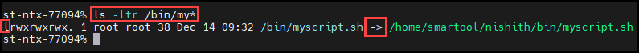

---

## 5. Searching Manual Pages

### Build Man Page Index

```bash
sudo mandb                    # Build manual page index
```

### Search Commands

```bash
apropos zip                   # Search commands related to 'zip'
man -k search                 # Same as apropos
man -k -s 1 password          # Section 1 commands related to 'password'
```


The `apropos` searches the Linux manual (man) pages and shows commands related to a keyword.
**For example:**
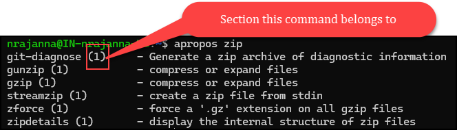

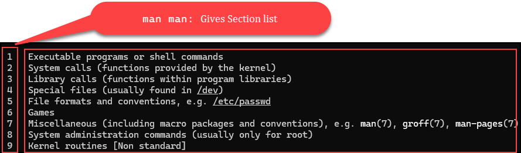

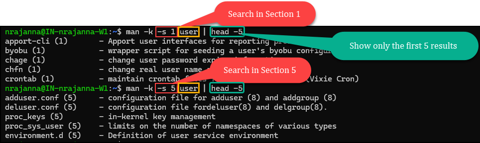

---

## 6. Viewing Files

```bash
cat -n file_name               # Display file with line numbers
```

---

## 7. Disk & File Storage

### Disk Free (Filesystem Level)

```bash
df -h                          # Human-readable disk free space
```

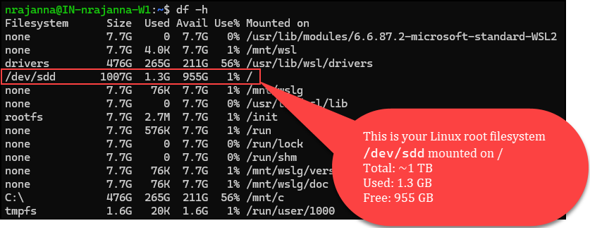

### Disk Usage (Directory/File Level)

```bash
du -ah                         # Displays disk usage at the file and directory level.
```

Sample output:


**`du -ah` vs `df -h`**
| Command  | Tells you                  |
| -------- | -------------------------- |
| `df -h`  | Filesystem free space      |
| `du -ah` | File/directory space usage |


---

## 8. Keyboard Shortcuts (Shell Editing)

```text
Ctrl + f   → Move cursor one character forward
Ctrl + b   → Move cursor one character backward
Alt  + f   → Move cursor one word forward
Alt  + b   → Move cursor one word backward
Ctrl + a   → Move to beginning of the line
Ctrl + e   → Move to end of the line
Ctrl + d   → Delete one character to the right
Ctrl + w   → Delete all text to the left
```

---

## 9. Variables (tcsh)

### Shell Variables

```bash
set msg="Hello World"
echo "$msg"
```

Output:

```text
Hello World
```

### List and Search Variables

```bash
set | less                   # List all tcsh variables
set | grep msg               # Search for a variable
```

### Environment Variables

```bash
setenv msg "Hello World"    # Export variable (similar to bash export)
/bin/tcsh                    # Start a new tcsh shell
echo $msg                    # Accessible due to setenv
```

### Unset Variables

```bash
unset msg                    # Remove shell variable
unsetenv msg                 # Remove environment variable
```

### Source Profile

```bash
source filename              # Reload a profile or script
```

---

## 10. Job Control

### Job Types

* **Foreground jobs** – running and taking input
* **Background jobs** – running without terminal interaction
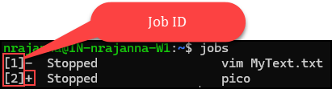
### Commands

```text
Ctrl + Z   → Pause a running job
jobs       → List active jobs
fg 1       → Bring job 1 to foreground
Ctrl + C   → Terminate a running program
command &  → Run command in background
watch cmd  → Run a command repeatedly
```

---

## 11. Jobs vs Processes

| Concept | Managed By | Identifier     |
| ------- | ---------- | -------------- |
| Job     | Shell      | Job ID (1,2,3) |
| Process | Kernel     | PID            |

Example:

```bash
watch date &
```

Output:

```text
[3] 1457262
```

* **3** → Job ID
* **1457262** → Process ID (PID)

---

## 12. Process Management

```bash
ps                            # View processes in current terminal
```

Important columns:

* **PID** – Process ID
* **TTY** – Terminal (TeliType)
* **CMD** – Command name
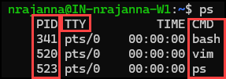
---

## 13. Signals & Killing Processes
```bash
kill -l                       # List all signals
```
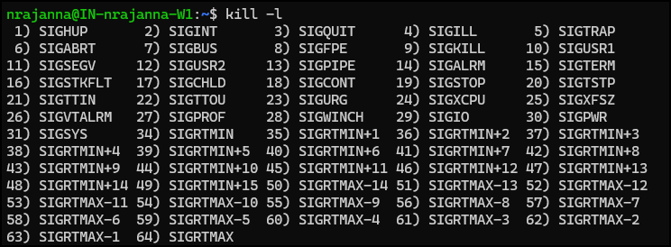

```bash
kill -9 PID                   # Force kill a process
```

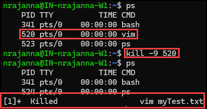

---

## 14. Redirection and Piping

### Standard Streams in Unix
Every Unix command works with three default streams:

| Stream | Name            | Description                    | Default Destination |
| ------ | --------------- | ------------------------------ | ------------------- |
| STDIN  | Standard Input  | Where command reads input from | Keyboard            |
| STDOUT | Standard Output | Normal command output          | Terminal (screen)   |
| STDERR | Standard Error  | Error messages                 | Terminal            |

By default:

* Output → **STDOUT → terminal**

#### Output Redirection (`>`)
```bash
echo "Hello World" > sample.txt
```

What happens:

* `echo` sends output to **STDOUT**
* `>` redirects STDOUT into `sample.txt`
* File is **created if it does not exist**
* File is **overwritten if it exists**

#### Overwriting vs Appending
**Overwrite (`>`)**
```bash
echo "Another try" > sample.txt
```
* Existing content is **discarded**
* File is rewritten from scratch

**Append (`>>`)**
```bash
echo "Hello World" >> sample.txt
```
* New content is added to the **end of the file**
* Existing content is preserved

Result:

```text
Another try
Hello World
```

### Piping (`|`)
A pipe sends:

```
STDOUT of command A → STDIN of command B
```

**Example:**
```bash
ls -l | grep Sam | awk '{print $9}'
```

1. `ls -l`             : Produces detailed file listing
2. `grep Sam`       : Keeps only lines containing `Sam`
3. `awk '{print $9}'`:  Extracts the **9th field** (filename)

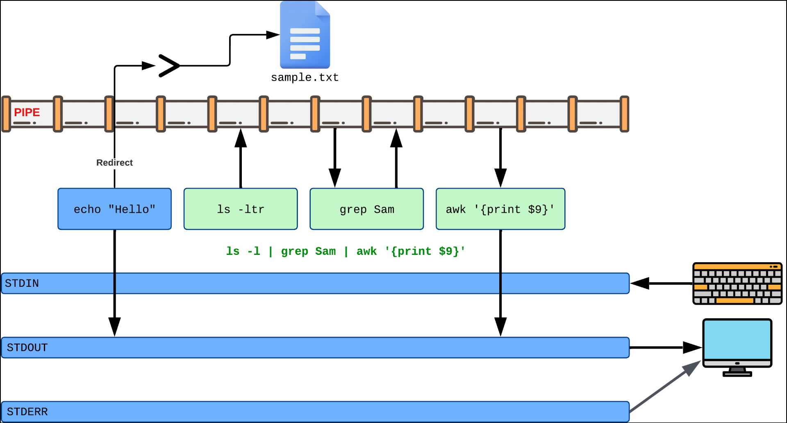

---

### Redirecting Errors (STDERR) and `/dev/null` 
Some commands (like `find`) produce a lot of **error messages** (for example: `Permission denied`).


These messages are often just **noise** when you're only interested in the actual results.

**STDOUT vs STDERR**
Unix commands typically use two output streams:

* **STDOUT (1)**: normal results/output
* **STDERR (2)**: error messages
Even if both appear on the screen by default, they are **different streams**.

**File descriptor numbers**

| Stream | Name            | Descriptor |
| ------ | --------------- | ---------- |
| STDIN  | standard input  | `0`        |
| STDOUT | standard output | `1`        |
| STDERR | standard error  | `2`        |

**Redirecting only STDOUT does NOT capture errors**
If you run:

```bash
find / -name junk > results.txt
```

You might still see many errors on screen.
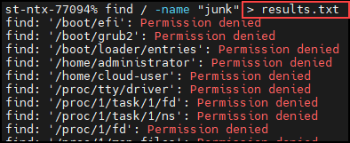
Why?

* `>` redirects **STDOUT (1)** only
* Errors are sent to **STDERR (2)**

So `results.txt` can be empty even though the screen shows lots of errors.

#### Redirect STDERR to a file (`2>`)
To capture errors:

```bash
find / -name junk 2> errors.txt
```
**Effect:**
* Error messages no longer print on the screen
* They are saved into `errors.txt`

**View the captured errors:**

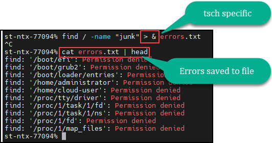

#### Suppress STDERR using `/dev/null`
If you do not care about error messages at all:
```bash
find / -name junk 2> /dev/null
```
**Explanation:**
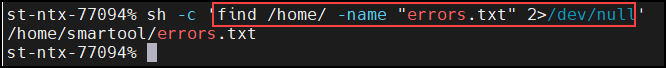

* Results are displayed to `STDOUT`. Errors to `/dev/null`
* `/dev/null` is a special “null” file
* Anything written to it is discarded immediately
* This is commonly used to **hide unwanted output**

**Redirect BOTH: STDERR to `/dev/null` and STDOUT to a file**
```bash
find ./ -name errors.txt 2> /dev/null > output.txt
```
**What happens:**
* `2> /dev/null` → suppresses **errors**
* `> output.txt` → saves normal output (matches) into a file


## 15. VIM
- `vi` is a classic Unix text editor that is installed on almost every Unix/Linux system.
- `vim` stands for **“Vi IMproved”** (a newer, enhanced replacement for `vi`).
- On many modern systems, running `vi` actually launches `vim`.

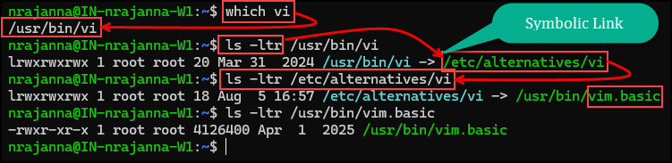

  **Modes in Vim**
* **Command mode**: navigate, run commands (default when you open a file)
* **Insert mode**: type/edit text

**Switch modes**
| Action                 | Key   |
| ---------------------- | ----- |
| Enter insert mode      | `i`   |
| Return to command mode | `Esc` |

### Navigation in command mode
**Move one character / line**
| Direction | Key |
| --------- | --- |
| Left      | `h` |
| Right     | `l` |
| Down      | `j` |
| Up        | `k` |

Arrow keys often work, but `h/j/k/l` keeps hands on home row.

**Page movement**
| Action    | Key                |
| --------- | ------------------ |
| Page down | `Ctrl+f` (forward) |
| Page up   | `Ctrl+b` (back)    |

**Jump to beginning/end of a line**
| Action        | Key |
| ------------- | --- |
| Start of line | `0` |
| End of line   | `$` |

**Jump to beginning/end of the file**
Press `:` to enter command-line mode inside vim.
| Action              | Command      |
| ------------------- | ------------ |
| Go to start of file | `:0` + Enter |
| Go to end of file   | `:$` + Enter |

**Basic word movement**
| Key | What it does                         |
| --- | ------------------------------------ |
| `w` | Move to **start of next word**       |
| `b` | Move to **start of previous word**   |
| `e` | Move to **end of current/next word** |


### Insert vs Append
Insert at cursor: `i`
Append after cursor: `a`
Append at end of line: `Shift+a`
Insert at beginning of line: `Shift+i`

### Deleting text
Delete a full line: `dd`
Delete a character under the cursor:`x`
Undo: `u`

### Repeat commands with a number prefix
You can run many vim commands multiple times by prefixing a number:
Delete 4 lines: `4dd`
Delete 25 characters: `25x`

### Searching within the file
Search forward: `/keyword`
Search backward: `?keyword`
Press **Enter** to jump to the match.

### Global search and replace
Enter command-line mode with `:` and use substitute.
Replace everywhere in the file:
```vim
:%s/import/export/
```
* `:%` = entire file
* `s` = substitute

`Vim` supports full regular expressions in substitutions.

### Saving and quitting
| Action                      | Command |
| --------------------------- | ------- |
| Save (write)                | `:w`    |
| Quit                        | `:q`    |
| Save and quit               | `:wq`   |
| Quit without saving (force) | `:q!`   |

**Save to a new file (copy)**
```vim
:w OtherFile.java
```

### Basic Copy & Paste
| Action            | Command | What it does                           |
| ----------------- | ------- | -------------------------------------- |
| Copy current line | `yy`    | Copies (yanks) the entire line         |
| Copy N lines      | `5yy`   | Copies 5 lines starting from cursor    |
| Paste below       | `p`     | Pastes copied content **below** cursor |
| Paste above       | `P`     | Pastes copied content **above** cursor |
| Cut (delete) line | `dd`    | Deletes line and copies it             |
| Cut N lines       | `5dd`   | Deletes 5 lines and copies them        |
| Undo              | `u`     | Undo last action                       |


## 16. Text Commands

### `head` and `tail` Commands
The `head` and `tail` commands are used to quickly view parts of large text files without opening the entire file.

`head filename`: Displays the first 10 lines of a file by default.
`tail filename`: Displays the last 10 lines of a file by default.
`head -n 3 filename.csv`: Shows the first 3 lines.
`tail -n 5 people-list.csv`: Shows the last 5 lines.

`tail -f logfile.log`: 
		- Displays the last lines of a file
		- Continues running
		- Shows new lines as they are appended

### `wc` Command
The `wc` command stands for **Word Count**.
The `wc` command counts:
- Lines (technically: newline characters)
- Words
- Bytes / characters
- `wc` prints newline, word, and byte counts for each file.
It works on **files** or on **input** received from another command via **piping**.

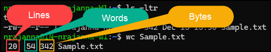

**Common options**

| Option | Meaning                    |
| ------ | -------------------------- |
| `-l`   | Count lines only           |
| `-w`   | Count words only           |
| `-c`   | Count bytes                |
| `-m`   | Count characters           |
| `-L`   | Length of the longest line |

**Validate output size from another command**

```bash
ls -ltr | wc -l
```

### The `sort` Command
It is used to **sort lines of text**.
```bash
sort fruits.txt
```

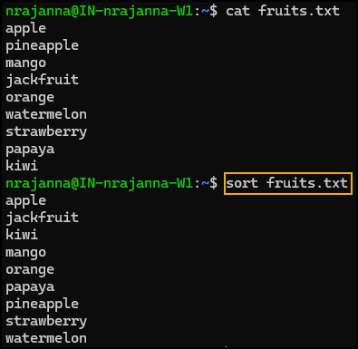

**Sorting via pipes**
```bash
cat fruits.txt | sort
```

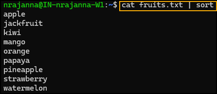

**Numeric sorting problem**
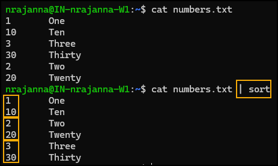

**Numeric sort**
To sort numerically, use `-g` option.
```bash
sort -g numbers.txt
```

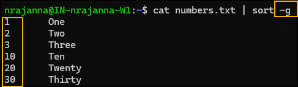

**Reverse sorting** 

```bash
sort -g -r numbers.txt
```

**Other useful sort options**

| Option | Meaning                           |
| ------ | --------------------------------- |
| `-g`   | General numeric sort              |
| `-n`   | Numeric sort                      |
| `-r`   | Reverse order                     |
| `-M`   | Sort by month names (Jan, Feb, …) |
| `-h`   | Human-readable numbers (K, M, G)  |
| `-R`   | Random sort                       |

**Sorting by column**
* **Field** = column
* CSV fields are separated by commas
* `sort` supports column-based sorting

| Option | Meaning                  |
| ------ | ------------------------ |
| `-t`   | Field delimiter          |
| `-k`   | Sort key (column number) |

```bash
head -n 5 people_list.csv | tail -n +2 | sort -t '/' -k 3
```

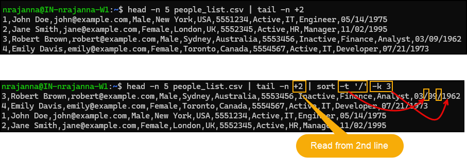

### The `grep` Command
* `grep` searches **lines of text** for patterns.
* Prints only the lines that **match** the pattern.
* Can work on files or piped input.
* Becomes extremely powerful when combined with **regular expressions**.

```bash
grep pattern filename
```
Example:
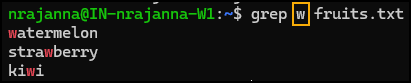

**Recommend to use quotes**
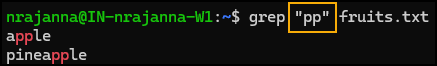

Quotes are recommended for:
* Multi-character patterns
* Regular expressions
* Safer shell parsing

**Case-insensitive search**
```bash
grep -i "Pp" fruits.txt
```

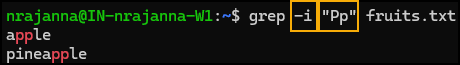 	

**Counting matches with `wc`**
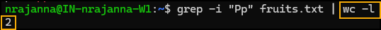
* Counts how many records matched

**Faster counting with `grep -c`**
* Counts matching lines directly
* More efficient than piping to `wc`

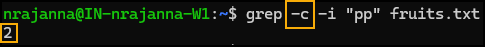

**Inverting matches (`-v`)**
* Shows lines that **do NOT match** the pattern

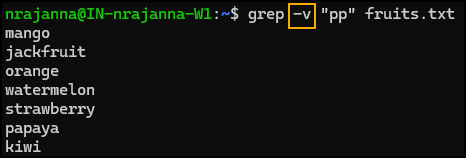

**Useful grep options**

| Option | Meaning        |
| ------ | -------------- |
| `-i`   | Ignore case    |
| `-v`   | Invert match   |
| `-c`   | Count matches  |
| `-P`   | Perl regex     |
| `-E`   | Extended regex |

### The `diff` Command

The `diff` is used to **compare two files line by line** and show the differences between them.

**Example 1:**
```bash
nrajanna@IN-nrajanna-W1:~$ diff fruits1.txt fruits2.txt
2d1
< jackfruit
5d3
< orange
9d6
< watermelon
```
The `diff` is telling you which lines are present in `fruits1.txt` but not in `fruits2.txt`.

**How to read `2d1`**
- 2 = line number in `fruits1.txt`
- d = delete
- 1 = line number in `fruits2.txt` (the position where the deletion happens relative to file2)
- 2d1 means: “To make `fruits1.txt` match `fruits2.txt`, delete line 2 from `fruits1.txt`.”
- And the next line shows what that deleted line is: `< jackfruit`

**Example 2:**
```bash
nrajanna@IN-nrajanna-W1:~$ diff fruits2.txt fruits1.txt
1a2
> jackfruit
3a5
> orange
6a9
> watermelon
```

**How to read 1a2**
- 1 → line number in `fruits2.txt`
- a → add
- 2 → line number in `fruits1.txt`
- “To make fruits2.txt match fruits1.txt, add a line after line 1.”
- The next line shows what to add: `> jackfruit`

**Key symbols**
| Symbol | Meaning                   |
| ------ | ------------------------- |
| `a`    | add                       |
| `d`    | delete                    |
| `c`    | change                    |
| `<`    | line from **first file**  |
| `>`    | line from **second file** |

#### Creating a Patch File
You can **save the output** of `diff` into a file called a `patch`.
```bash
diff file1 file2 > patch
```

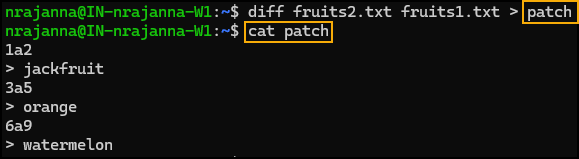

**Applying a Patch with `patch` command**

The `patch` command can apply a `diff` output to a file.
```bash
patch file1 patch
```

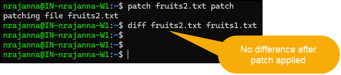

**Side-by-Side Comparison**
You can compare files side by side using: `diff -y file1 file2`

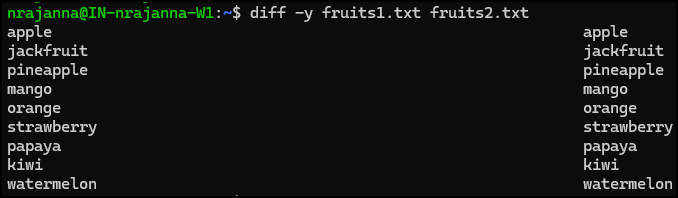

**Useful diff Options**

| Option      | Description                      |
| ----------- | -------------------------------- |
| `-y`        | Side-by-side comparison          |
| `-i`        | Ignore case differences          |
| `-w`        | Ignore whitespace                |
| `-q`        | Report only whether files differ |
| `--version` | Show diff version                |

### The `tr` Command
The `tr` stands for translate. It is a simple but powerful Unix utility used to:
- Translate characters from one set to another
- Delete characters
- Squeeze (collapse) repeated characters
- `tr` works on streams of text (`stdin → stdout`). It does not take filenames directly, so it is usually used with pipes (`|`).

**Syntax:**
```bash
tr [OPTIONS] SET1 SET2
```
- `SET1` → characters to translate from
- `SET2` → characters to translate to

**Example:**
```bash
 cat fruits1.txt | tr [a-z] [A-Z]
 ```

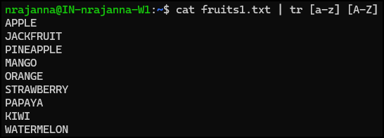

```bash
cat fruits.txt | tr [:lower:] [:upper:]
```

**Common Character Classes**
| Class       | Meaning              |
| ----------- | -------------------- |
| `[:lower:]` | lowercase letters    |
| `[:upper:]` | uppercase letters    |
| `[:alpha:]` | letters only         |
| `[:alnum:]` | letters + digits     |
| `[:digit:]` | digits (0–9)         |
| `[:blank:]` | space and tab        |
| `[:print:]` | printable characters |

**Quick Cheat Sheet**
```bash
tr 'a-z' 'A-Z'              # lowercase → uppercase
tr '[:upper:]' '[:lower:]'  # uppercase → lowercase
tr -d ','                   # delete commas
tr -cs '[:alnum:]' '\n'     # words on separate lines
tr ',' ':'                  # change delimiter
```

## 17.AWK
- `AWK` is a text-processing utility in Unix/Linux.
- It is often called a “**Swiss Army knife**” because:
	- It can scan text
	- Split records into fields
	- Filter lines
	- Perform calculations
	- Generate reports
- `AWK` is especially powerful for CSV files, logs, and structured text data.

### Conceptual Structure of an AWK
The `C++` code shown below represents how `AWK` internally works.
Conceptually, `AWK` has three sections:
```TEXT
BEGIN  →  PROCESS EACH LINE  →  END
```

#### BEGIN Block (Optional)
- Code that runs before reading any input lines.
- Purpose
	- Initialize variables
	- Print headers
	- Set field separators

**Example**
```bash
BEGIN {
    FS = ","      # Field Separator
    print "Report Start"
}
```

#### Main Processing Block
- This is where most AWK work happens.
- What AWK does internally is, for **every line**:
	- Reads the line
	- Increments record count
	- Splits the line into fields
	- Executes your logic
 
**Example:**
```bash
NR > 1 { print $1 }			# Skip header (first line) and Print first column
```

#### END Block (Optional)
- Code that runs after all lines are processed
- Purpose
	- Print totals
	- Print summaries
	- Print footers

**Example:**
```bash
END {
    print "Total Records:", NR
}
```

### AWK Internal Flow (Pseuocode)
- Important to note some of the variables such as `NR`
- Also note we can add `if`
```CPP
class Awk
{
private:
    static int NR;              // Current Record Number
    static int NF;              // Number of fields in current line
    static string FS;           // Field Separator

public:
    int main(int argc, char* argv[])
    {
        begin();   // BEGIN block (optional)

        // Read all lines from input file or pipe
        vector<string> lines = readAllLines("blah/blah/blah");

        for (string line : lines)
        {
            if (processLine(line))     // pattern matching (NR > 1, /regex/, etc.)
            {
                NR++;

                // Split line into fields using FS
                vector<string> fields = split(line, FS);
                NF = fields.size();

                // $0 = line, $1..$NF = fields
                process(line, fields);
            }
        }

        end();     // END block (optional)
        return 0;
    }

private:
    // BEGIN { ... }
    static void begin()
    {
        // Initialize variables
        // Print header if required
    }

    // Pattern evaluation (NR > 1, /regex/, etc.)
    static bool processLine(string line)
    {
        return true;   // default: process all lines
    }

    // Main AWK action block
    static void process(string line, vector<string> fields)
    {
        // $0 = line
        // $1 = fields[0]
        // $2 = fields[1]
        // ...
        // $NF = fields[NF-1]

        // Example:
        // if (stoi(fields[1]) > 100)
        //     print(fields[0]);
    }

    // END { ... }
    static void end()
    {
        // Print footer or summary
    }
};

```

**Mapping C++ → AWK**
| C++ Concept | AWK Equivalent     |
| ------------------ | ------------------ |
| `begin()`          | `BEGIN { }`        |
| `for each line`    | Implicit line loop |
| `line`             | `$0`               |
| `fields[0]`        | `$1`               |
| `fields[1]`        | `$2`               |
| `NR`               | `NR`               |
| `NF`               | `NF`               |
| `process()`        | `{ action }`       |
| `end()`            | `END { }`          |


**Internal Flow:**
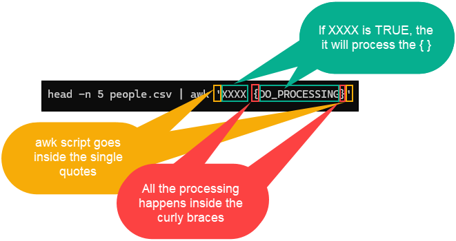

Example:
```bash
head -n 5 people.csv | awk 'NR>1 {print $0}'
```

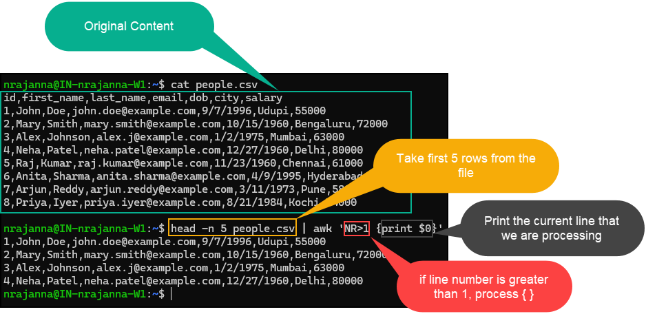

```TEXT
id,first_name,last_name,email,dob,city,salary
1,John,Doe,john.doe@example.com,9/7/1996,Udupi,55000
2,Mary,Smith,mary.smith@example.com,10/15/1960,Bengaluru,72000
3,Alex,Johnson,alex.j@example.com,1/2/1975,Mumbai,63000
4,Neha,Patel,neha.patel@example.com,12/27/1960,Delhi,80000
5,Raj,Kumar,raj.kumar@example.com,11/23/1960,Chennai,61000
6,Anita,Sharma,anita.sharma@example.com,4/9/1995,Hyderabad,69000
7,Arjun,Reddy,arjun.reddy@example.com,3/11/1973,Pune,58000
8,Priya,Iyer,priya.iyer@example.com,8/21/1984,Kochi,74000
```

**LEVEL 1 – Absolute Beginner**

- Print every line in the file using `AWK`.
```bash
cat people.csv | awk '{print}'
```

- Print only the header line.

```bash
cat people.csv | awk 'NR==1{print}'
```

- Print all data rows (skip header).
```bash
cat people.csv | awk 'NR>1{print}'
```

- Print line number and full line.
```bash
cat people.csv | awk 'NR>1{print NR, $0}'
```

**LEVEL 2 – Working with Fields (`$1`, `$2`, …)**
- Print `first_name` `last_name`
```bash
cat people.csv | awk 'BEGIN{FS=","} {print($2, $3)}'
```
- Print `id` `email`
```bash
cat people.csv | awk 'BEGIN{FS=","} {print($1, $4)}'
```
- Print `city` and `salary` separated by `:`.
```bash
cat people.csv | awk 'BEGIN{FS = ","} {print($6":"$7)}'
```
- Print number of fields (`NF`) for each row.
```bash
cat people.csv | awk 'BEGIN{FS=","} {print(NF)}'
```

**LEVEL 3 – Filtering Rows**
- Print employees `first_name` whose `salary > 70000`.
```bash
cat people.csv | awk 'BEGIN{FS=","} NR>1 && $7>70000{print($2)}'
```

- Print employees `first_name` who live in `Bengaluru`.
```bash
cat people.csv | awk 'BEGIN{FS=","} NR>1 && $6=="Bengaluru"{print($2)}'
```
- Print employees `first_name` whose city starts with `P`.
```bash
cat people.csv | awk 'BEGIN{FS=","} NR>1 && $6 ~ /^P/ {print($2)}'
```

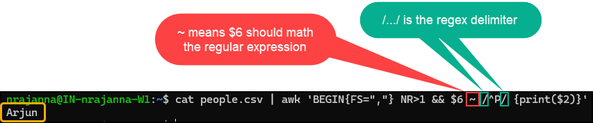

- Print `first_name`, `last_name` and `dob` of employees born before `1970`
```bash
cat people.csv | awk 'BEGIN{FS=","} NR>1 { split($5, arr, "/"); if(arr[3]<1970) print($2, $3, $5)}'
```

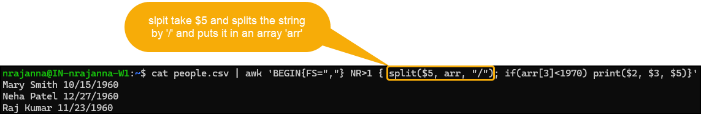

**LEVEL 4 – Calculations & Counters**
- Calculate and print `total salary` of all employees.
```bash
cat people.csv | awk 'BEGIN{FS=","} NR>1 {total+=$7} END{print total}'
```

- Calculate average `salary`.
```bash
cat people.csv | awk 'BEGIN{FS=","} NR>1 {total+=$7} END{print total/(NR-1)}'
```

- Count how many employees live in South Indian cities
(Udupi, Bengaluru, Chennai, Kochi, Hyderabad)
```bash
```

- Print the employees with the highest salary.
```bash
```

**LEVEL 5 – BEGIN & END**
- Print a report like:
```bash
---- Employee Salary Report ----
<employee data>
-------------------------------
Total Employees: X
```

**LEVEL 6 – Real-World Reporting Tasks**
- Print output like:
```TEXT
John Doe earns 55000 and lives in Udupi
```
- Group employees by city and print count per city.
```bash
```

- Print employees `first_name` aged 60+ years (based on DOB).
```bash
```

- Create a salary band report:
```TEXT
Below 60,000
60,000–70,000
Above 70,000
```

## 18. The `SED` Command
- **`sed`** stands for **Stream Editor**
- It is a **programmable text editor**
- Unlike editors like **vi**, **nano**, or **pico**:
  - You do NOT open a file interactively
  - You do NOT manually edit text
- `sed` works by:
  - Reading text **line by line**
  - Applying commands automatically
  - Writing the result to **standard output**


**Why is `sed` Useful?**
- Automates changes across **large text files**
- Extremely **fast and memory-efficient**
- Processes **one line at a time**
- Commonly used together with **AWK**
- Most popular use case:
  - **Search and Replace**
 
**How `sed` Works (Conceptually)**
1. Reads one line from input
2. Applies command(s)
3. Outputs modified line
4. Moves to next line

**Basic `sed` Syntax**
```bash
sed 'command' file
```

### The Substitution Command `s`
**Syntax:** `sed 's/pattern/replacement/options'`
- `s` → substitute
- `pattern` → what to search for (`regex`)
- `replacement` → what to replace with
- `options` → how to apply substitution

**Example: Replace Commas with Colons**
```bash
sed 's/,/:/g' people.csv
```

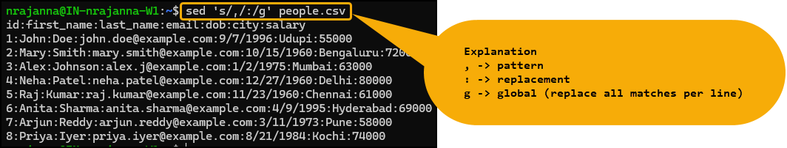

- Without `g`, replaces only the **first comma per line**.

**Using Different Delimiters**
- By default, `/` is used as delimiter:
- Syntas: `s/pattern/replacement/`
- But you can **use any character**:
```bash
sed 's|/|#|g' file
sed 's@/@#@g' file
sed 's#/#_#g' file
```
  
#### Some Examples:
**Delete First Line (Header)**
```bash
sed '1d' file
```

**Delete a Range of Lines**
```bash
sed '2,4d' file   # Deletes lines 2 to 4
```

**Inverting Selection (`!`)**
```bash
sed '2,4!d' file  # Keep only lines 2 to 4, delete everything else
```

**Skip Header Row**
```bash
sed '1d' people.csv # Or sed '2,$p' people.csv
```

**Line Range Keywords**
| Symbol | Meaning            |
| ------ | ------------------ |
| `1`    | First line         |
| `$`    | Last line          |
| `2,$`  | From line 2 to end |

## 19. The `xargs`
- `xargs` is a command-line tool that **builds and runs commands** using input it receives from **stdin** (usually via a pipe).
- Think of it like: **“take output from one command → turn it into arguments for another command.”**
- Very useful when you have **many items** (file names, numbers, lines) and you want to run the **same command** on each item **without writing a script**.

**Examples:**
- Rename many files
- Move/copy many files
- Run `rm`, `chmod`, `grep`, etc. on a list of files
- Generate repeated operations from a sequence of numbers

**How `xargs` Reads Input**
- By default, `xargs` splits incoming text on **whitespace**:
  - spaces
  - newlines
  - tabs
- Each token becomes an **input item** (an argument).

**Common Pattern**
```bash
<command-producing-list> | xargs <command-to-run>
```

### Using a “Replacement String” with `-I`
Sometimes you want to place the **input** item in a **specific position** in your command.

**Syntax:** `... | xargs -I {} <command with {}>`
Here `-I {}` tells `xargs`: “For each input `item`, replace `{}` with that `item`.”

**Example: Rename Many Files (Add .txt Extension)**
```TEXT
nrajanna@IN-nrajanna-W1:~$ ls -ltr
total 20
-rw-r--r-- 1 nrajanna nrajanna 342 Dec 15 15:30 Sample
-rw-r--r-- 1 nrajanna nrajanna  47 Dec 15 15:50 numbers
-rw-r--r-- 1 nrajanna nrajanna  73 Dec 16 05:28 fruits1
-rw-r--r-- 1 nrajanna nrajanna  73 Dec 16 06:08 fruits2
-rw-rw--w- 1 nrajanna nrajanna 518 Dec 16 09:09 people
```

```bash
ls * | xargs -I {} mv {} {}.txt
```


## 20. Searching for files
- `find` is a powerful Unix command used to **search for files and directories**.
- It can search by many file attributes, such as:
  - **name**
  - **size**
  - **permissions (mode)**
  - **owner/user**
  - **timestamps** (modified/accessed/changed times)
- It can also **execute a command** on each matched file (similar to `xargs`).


**`find` by Name**
```bash
find . -name 'fruits*'
```


## 21. Linux Users, Passwords, and Privileges
**What is a User in Linux?**
- A **user** is an identity that can log in, run programs, and own files.
- Every user has:
  - Username
  - User ID (UID)
  - Group ID (GID)
  - Home directory
  - Login shell

**Home Directory**
- Default location:  `/home/<username>`

Example:
- `/home/nrajanna`
- `/home/bob`

When a user logs in:
- The system places them in their home directory.
- Shell startup files like `.bashrc` are loaded.

`/etc/passwd` File stores user account information.
Format: `username:x:UID:GID:Full Name:Home Directory:Shell`

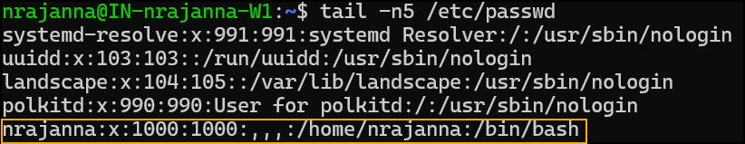

### The `/etc/shadow` File
Stores encrypted passwords.


### The Root User
- The superuser is named root
- Root can perform any action
- Home directory: `/root`
- Shell: ``/bin/bash`

### The `sudo` Command
- `sudo` = superuser do
- Allows temporary root access.
- Not all users can use `sudo`.

### Creating a User
```bash
sudo adduser bob
```
This:
- Creates home directory.
- Sets password.
- Creates a group named `bob`.

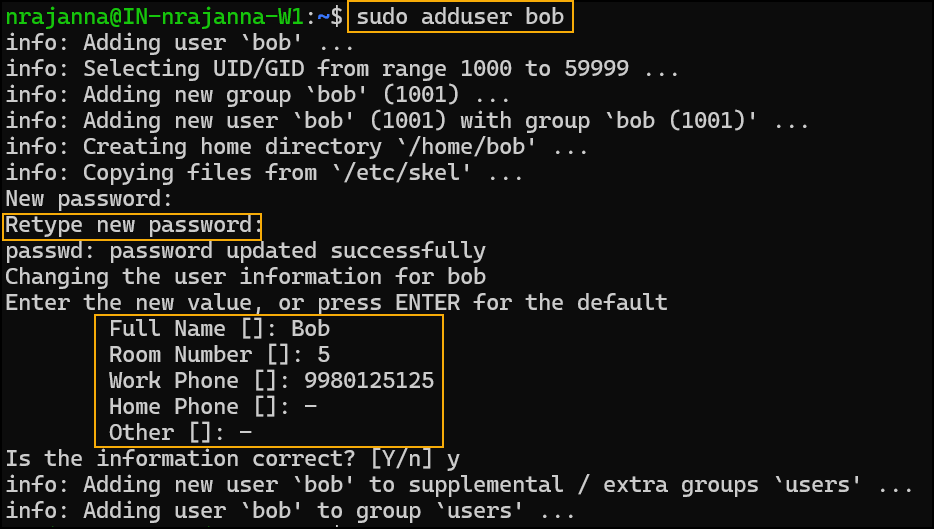

### Changing Passwords
To Change your own password:
```bash
passwd
```

To Change another user's password
```bash
sudo passwd bob
```

### Switching Users (`su`)
`su` = substitute user
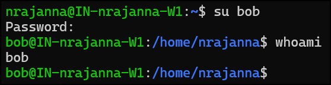


## 22. Linux Process Management
** What Is a Process?**
- A **process** is a running program.
- Each process has a unique **Process ID (PID)**.
- Programs started from a shell become child processes of that shell.

**Terminals and Sessions**
- Each terminal is a **separate session**
- Processes started in one terminal:
  - Are not visible by default from another terminal
- Historically:
  - Users connected via **dumb terminals**
  - Terminals were keyboard + monitor only
- Modern systems emulate this concept virtually

### The `ps` Command (Process Snapshot)
- Shows a snapshot of running processes
- Default behavior:
	- Shows processes started in the current terminal only
 
Example: `ps aww`
Below is the screenshot of a part of the output which got by running `ps aww | less`
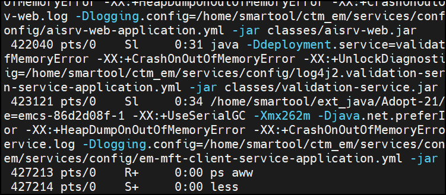

**Viewing All System Processes**
To see all the processes that are running, use `ps aux`

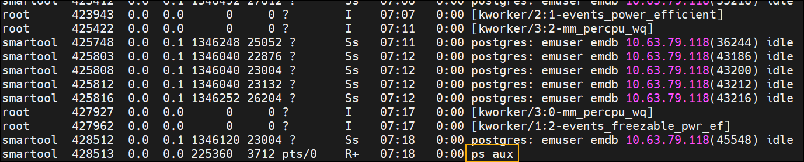

Shows:
- All users
- All terminals
- Background/system processes


**Process Hierarchy (Parent / Child)**
To get a **Tree-style output**, run `ps af`

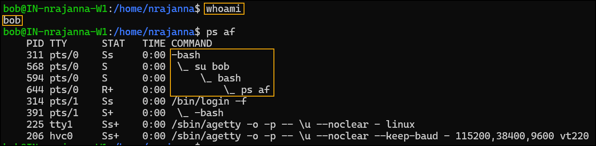

Killing a parent process kills all child processes.

**Important `ps` Options Explained**
`ps a`
Shows processes for current terminal
Includes session leaders

`ps -a`
Shows processes for all terminals
Excludes session leaders

`ps x`
Shows processes without a terminal
Includes system/background services

`ps aux`
Most commonly used
Shows almost everything

### Filtering Processes
**Filter by command name**
```bash
ps -C java
```

**Using grep (very common)**
```bash
ps aux | grep java
```

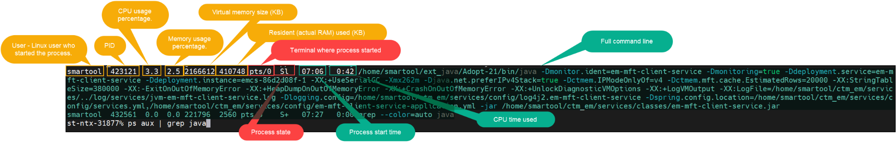

**Filter by PID**
```bash
ps -p 15333
```

**Filter by group**
```bash
ps -G developers
```


### Killing a Process
**Basic kill command**: `kill -9 <PID>`

What -9 Means
- `-9` = `SIGKILL`
- Cannot be ignored
- Immediately terminates process
- `kill` sends signals — it is not just for killing

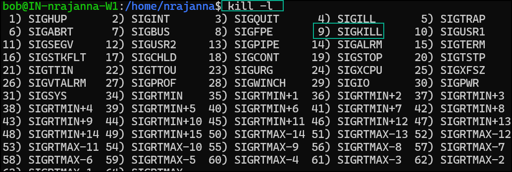


## 23. The `top` Command – System Monitoring
**What is `top`?**
- `top` is a **real-time system monitoring tool**
- Continuously refreshes system statistics
- Shows:
  - CPU usage
  - Memory usage
  - Load average
  - Running processes (sorted)


**Start `top`:**
```bash
top
```

**Example:**

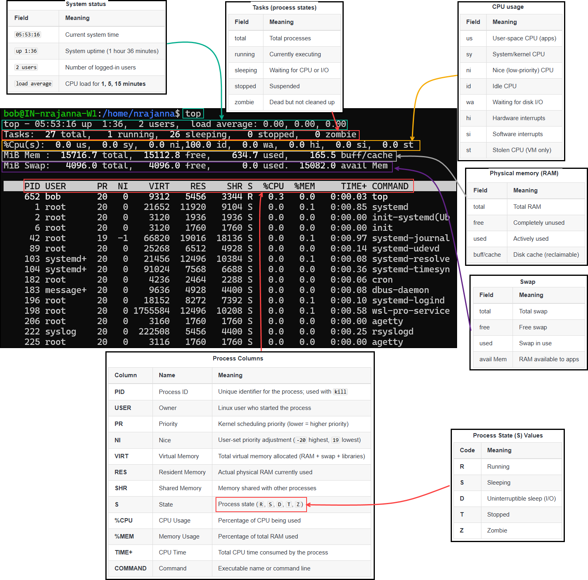

**Customizing Columns**: `f`
Inside `f` mode
- ↑ ↓ → Move between fields
- → → Select field
- ← → Deselect field
- Space → Toggle column on/off
- ↑ ↓ (when selected) → Move column position


**Sorting Processes**:`s`

## 24. The `lsof` and `fuser` Commands

### The `lsof` command
#### Common Real-World Problem
**Scenario**
- You try to start an application (e.g. Java / Spring Boot)
- Application **fails with an exception**
- Error message indicates:
  - Database file is locked **OR**
  - Port (e.g. 8080) is already in use

**Example errors:**
- `File is locked`
- `Database may be already in use`
- `Port 8080 already in use`

**Cause:**
- Another process is already running and using the same resource

#### Key Concept: Everything Is a File in UNIX
In UNIX/Linux:
- Regular files (database files)
- Network ports
- Devices
- Sockets

All are treated as **files**

So:
- If a file or port is in use
- Another process owns it

#### Finding Which Process Is Using a File `lsof`
- `lsof` = List Open Files
- `lsof` shows which process is using what

**See files opened by a specific process ID**:`lsof test.log`
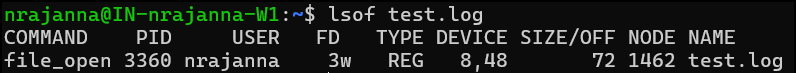

**Find open files by `PID`**: `lsof -p 3360`

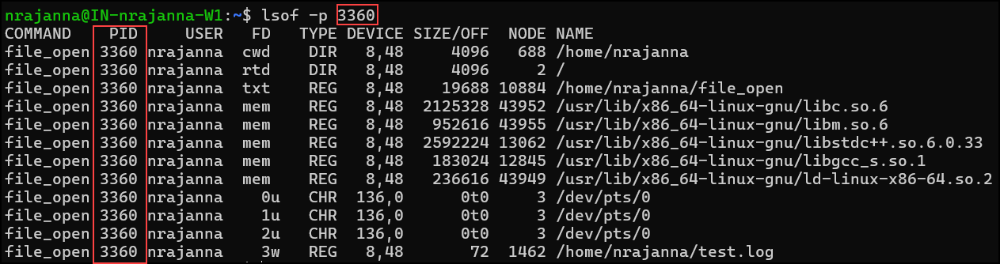

**Check which process is listening on a port**: `lsof -i :8443`

**Check all listening ports**: `lsof -i -P -n | grep LISTEN`

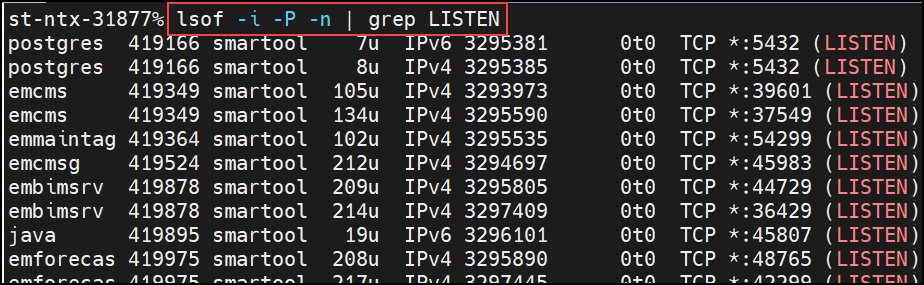


### The `fuser` command
**What is `fuser`?**
The `fuser` shows which process(es) are using a file, directory, or socket (port) and it can kill those processes directly.

**Basic syntax:**
```bash
fuser [options] file | directory | port
```

**Example:**
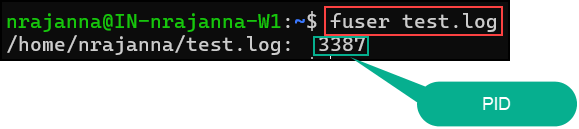

**See more details**: `fuser -v test.log`
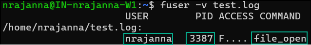

**Find which process is using a directory**: `fuser -v /home/nrajanna/`
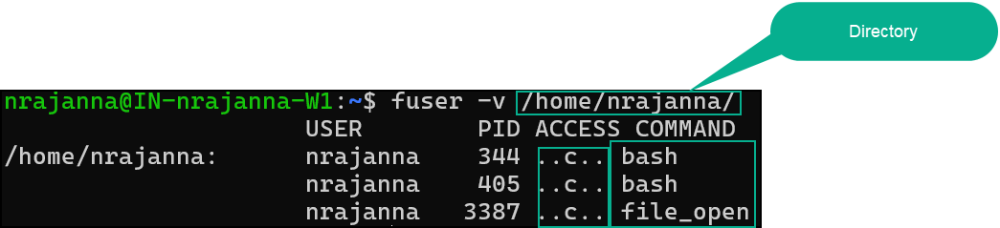

**ACCESS flags explained:**
| Flag | Meaning           |
| ---- | ----------------- |
| `F`  | File open         |
| `r`  | Read              |
| `w`  | Write             |
| `c`  | Current directory |
| `e`  | Executable        |

**Find who is using a port**: `fuser -v 8088/tcp`


**Kill processes using a file or port**
Kill process using a file: `fuser -k test.log`
Kill process using a port: `fuser -k 8088/tcp`


#### Compare with `lsof`
| `fuser`                 | `lsof`                        |
| ----------------------- | ----------------------------- |
| Fast, simple            | Detailed, verbose             |
| Good for ports & mounts | Good for logs & deleted files |
| Can kill directly       | Safer, inspection-first       |
| Limited output          | Rich output                   |

## 25. Networking Basics (UNIX & Linux)
Networking is how computers communicate with each other to send and receive data.  
On UNIX/Linux systems, many tools and commands help you view, test, and manage these communications.

#### Basic Network Components

 👤 **End User**
- This is **you** using a computer or laptop.
- Example: Opening a browser to visit `amazon.com`.

🌍 **Internet**
- The Internet is a **collection of millions of interconnected networks**.
- Data travels through many routers before reaching its destination.

📡**Router**
- Connects your local computer/network to the Internet.
- Performs:
  - Routing (deciding where data goes)
  - IP address translation (NAT)


#### Servers and Services

🖥️**Server**
- A server is a computer that **provides services** to other computers.
- Example services:
  - Web applications
  - Databases
  - APIs

⚙️**Service**
- A **program running on a server** that listens for requests.
- Example:
  - PeopleDB Web Application
  - Another internal service

#### Ports (Very Important!)

- A **port** identifies *which application* you want to talk to on a server.
- A server can have **thousands of ports**.

**Common Ports**
| Port | Purpose |
|-----|--------|
| 80  | Default HTTP (websites) |
| 443 | HTTPS |
| 8080 | Common alternate web port |
| 9090 | Custom application port |

**Example:** `localhost:8080`
- `localhost` → the computer itself
- `8080` → the port where the web application is running

If you **do not specify a port**, the browser assumes **port 80**.

** IP Addresses**
🌐**Public IP Address**
- Used on the Internet
- Example: `205.x.x.x`
- Reachable from anywhere

🏠**Private IP Address**
- Used inside local networks
- Not reachable directly from the Internet
- Common private ranges:
  - `192.168.x.x`
  - `10.x.x.x`

Example:`192.168.1.14`
This is a **private IP**, not directly accessible from the Internet.

#### DNS (Domain Name System)

**What is DNS?**
DNS translates **domain names** into **IP addresses**.

**Example:** `amazon.com → 205.xxx.xxx.xxx`

**Why DNS is needed**
- Humans remember names easily
- Computers need IP addresses

Your computer:
1. Asks a DNS server for the IP
2. Gets the IP address
3. Sends the request to that IP

#### NAT (IP & Port Translation)
- Routers perform **Network Address Translation (NAT)**.
- Converts:
  - Public IP → Private IP
  - Sometimes Public Port → Internal Port

**Example:**
Public: `205.x.x.x:80`
Private: `192.168.1.13:8080`
This allows:
- Multiple servers behind one public IP
- Secure internal networking

#### Network Interfaces

**Physical Interface**
- Example: `eth0`
- Represents an **Ethernet network card**
- Has its own IP address

**Loopback Interface (Very Important)**
- **Virtual (software-based) interface**
- Used for communication **within the same computer**

| Property | Value |
|-------|------|
| IP Address | `127.0.0.1` |
| Name | `localhost` |
| Purpose | Local testing |

#### Loopback Interface Explained

**Why Loopback Exists**
- Allows programs on the **same machine** to communicate
- No network cables required

**Example**
A web browser and web server running on the same machine:
`http://localhost:8080`
or
`http://127.0.0.1:8080`

Both mean:
> “Connect to the service running on **this computer**”

**Key Rule**
- `127.0.0.1` is **always** the loopback address
- Same on all UNIX/Linux systems
- No DNS lookup required

#### Services Listening on Interfaces

- Most services:
  - Listen on **all interfaces by default**
  - Including `eth0` and `lo` (loopback)

This allows:
- Local testing
- External access (if permitted)

#### Why This Matters for UNIX/Linux
Understanding networking helps you:
- Troubleshoot connectivity issues
- Use commands like:
  - `ping`
  - `netstat`
  - `ss`
  - `ip`
  - `ifconfig`
- Configure services
- Understand logs and errors

### Interfaces, IP Addresses, and Connectivity
Why These Commands Matter
As a developer working with servers, you may need to know:
- What **IP addresses** are bound (assigned) to the server
- What **network interfaces** exist (physical + virtual)
- Whether another host is **reachable**
- What **route (hops/routers)** traffic takes to reach a destination

**Network Interfaces & “Bound” IP Addresses**
- A computer/server can have **multiple interfaces**
- Each interface can have **one or more IP addresses**
- “Bound” means the IP is **associated with** a specific interface on the machine

Common interfaces:
- **Loopback**: `lo0` (Mac) / `lo` (Linux) → used for local machine communication
- **Ethernet**: `en0` (Mac) / `eth0` (older Linux) / `ens*` (newer Linux naming)

**The `netstat` Command**
`netstat` stands for Network Statistics.
It is used to:
- View network connections
- See listening ports
- Check network interfaces
- Troubleshoot network issues

On modern Linux systems, `ss` is replacing `netstat`, but `netstat` is still widely used and very common in UNIX/Linux environments.

**`netstat -i`**
- `-i` → Interfaces
- Shows statistics for network interfaces
- “How much data has flowed through each network interface?”


**`netstat -p`**
- Show `PID` and program name using each connection.
